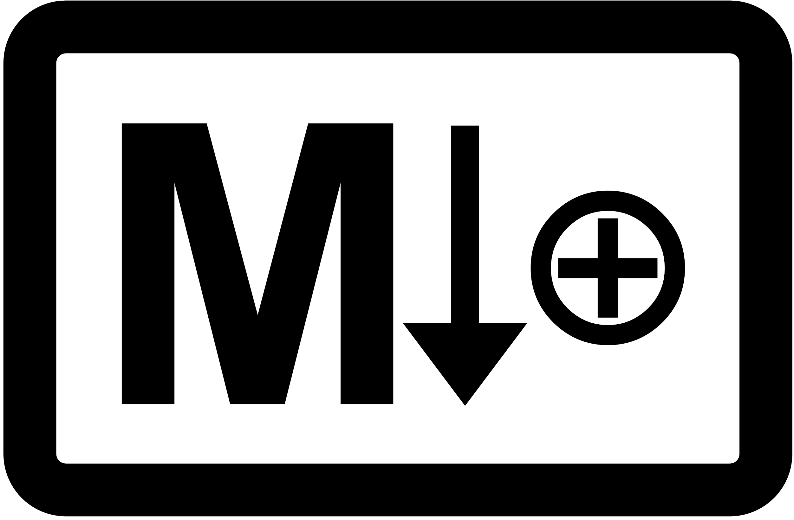

# MeOS — Membrane OS

<p align="center"></p>

### **Markdown⊕** — *Markdown, plus.*

MeOS speaks **Markdown⊕**: plain Markdown, extended with **membranes** (the ⊕). A membrane is just a comment — so a Markdown⊕ document stays 100% valid Markdown, and the very same notation works in code. Markdown gave you *formatting*; **Markdown⊕ adds structure, navigation, and bi-directional links** — without touching your data.

> **A new world — where comments become commands.**
>
> **It never stains your code or your manuscript — not by a millimeter.**
>
> **The lightest OS. Warp anywhere and jump both ways with the Hyper TOC.**
>
> **Your code undergoes cleavage (卵割) and becomes a single living organism.**
>
> **The ultimate environment for creation!!!**
>
> **And the future is in view: bi-directionally linking every membrane on Earth.**
>
> ## **I, My, MeOS 🐣**
>
> ## **Ai, Mai, MeOS 🐥**

---

## MeOS for VSCm — Fold Membrane, Anywhere Bi-Link

> Part of **MeOS™ for anywhere** — the universal membrane notation.  
> Abbreviated as **μOS** (read: mu-OS / mi-OS / me-OS).  
> *"micro-OS" on the surface — **membraneOS** at the root.*

> **VSCm** = **VSCodium folded.** The middle `odiu` is collapsed (just as MeOS folds membrane content), leaving the final **m** — the same **m** that begins **m**embrane. The host editor renamed by its own guest notation: self-referential, compact, and symbolic.

*The VSCm implementation of MeOS. MeOS notation itself is editor-independent; future implementations may target Joplin, Cursor, Obsidian, or any editor that supports comments.*


## The Crux of Membrane Notation

**A membrane is a comment — so it leaves your original data as it is.**  
**That is the crux of Membrane notation.**  
**More than a boundary, a membrane has its own functions — comments (semantic metadata) create structure, like a cell membrane.**

## VSCodium meets Me.  
## It becomes MeOS — the Brain Editor.

### Beyond Hyperlink — Navigate by Name, Return by Bookmark

**Membrane names are proper nouns.** Type a name in a TOC or a checklist — or search your whole workspace for it — and jump straight to that membrane.

**🔖 Bookmarks bring you home.** Drop up to three "place" bookmarks; one click flies you to your **Front Anchor** — the very line you're writing now. With two bookmarks, it becomes a **bidirectional jump**: leap there, and back, again and again.

Me (Membrane) transforms VSCodium into a Brain Editor for writers, developers, researchers, and AI.

Membrane structure introduces named, foldable, navigable thought architecture into code and text:

- Fold beyond headings
- Jump instantly by membrane name — from TOCs, checklists, or workspace search
- Return anywhere with bookmarks — three place markers and a one-click Front Anchor
- Use membrane names as proper nouns for workspace-wide discovery
- Build AI-readable and human-readable structured memory
- Transform notes, code, and knowledge into MeOS

This extension itself was co-created with AI trained to use membrane notation.

Once experienced, VSCodium can evolve from a code editor into a note system, thought system, and Brain Editor.

MeOS imagines a future where editors, note apps, and even operating systems become membrane-native.

---

## Core Formula

```text
MeOS := VSCodiuM = VSCodium + Membrane
```

```text
Hyperlink connected pages.
BiperLink connects meaning — by text, bidirectionally, from anywhere.
```

```text
MeOS for anywhere  ← the universal notation (parent brand)
MeOS for VSCodium  := μVSCodium      (this implementation, folded form)
MeOS for Mac       := μMac           (future)
MeOS for Phone     := μPhone         (future)
MeOS for Pad       := μPad           (future)
MeOS for OS        := μOS            (the OS layer, where the abbreviation folds into itself)
```

**MeOS** is the legal/registered name. **μOS** is the abbreviation /
stylized form, used for logos, titles, and folded forms (μVSCodium,
μMac, μPhone). Both refer to the same notation; the choice is visual.

Read the prefix **μ** as "μ" (mu), "mi", or "me" — your call.
The Greek letter is the *folded* form (written, compact).
The spoken word is the *unfolded* form (mePhone, miPhone, μPhone).
The meaning is **「私の」** — *mine*, *one with me*.

**μ is simply the Greek letter that corresponds to English m.**
Both descend from Phoenician *mem* (𐤌, "water" — the sound of waves).
The shift m → μ is not a substitution to a foreign symbol; it is the same
letter, traced back to its foundational form. Latin **m**, Greek **μ**,
Cyrillic **м** — all carry the same sound across scripts.

Apple's **i** prefix marked devices *for* the individual.
The **μ** prefix marks devices *structurally aligned with* the self.
Where **i** pointed outward at "the individual customer",
**μ** points inward at "the self that has folded into the device".

μ is also the SI symbol for *micro* — the smallest meaningful unit,
the most compact carrier of meaning. A perfect membrane.

And μ is the first letter of Greek **μέμβρανα** (*membrana*, "membrane")
itself. The glyph **structurally encodes its own meaning** — μOS reads
as "micro-OS" on the surface, but unfolds to **membraneOS** at its root.

---

## License & Trademark

### Notation — Public Domain

The **MeOS notation specification** (membrane syntax, BiperLink `⇄`,
Me notation `⇒`, badge format, depth markers, etc.) is dedicated to
**the public domain**. The notation is intended to become a universal
technical convention, in the spirit of open scientific terms like
**iPS**, **DNA**, **JSON**, and **YAML**.

Anyone may implement, document, teach, fork, or extend the MeOS
notation in any editor, language, framework, or system **without
permission, attribution, or fee**. Derivative notations are welcome.

### Software — MIT License

This VSCodium extension's source code is released under the **MIT
License**. See `LICENSE` in the repository root. The extension is
freely available for use, study, modification, and redistribution.

### Trademark — Common-Law ™ (Unregistered)

**MeOS™** and **μOS™** are **unregistered common-law trademarks**
asserted by **川嶋俊克 (Toshikatsu Kawashima)** as of **2026.05.16**,
with prior art established via this repository's GitHub commit history.

The following **name variants are also asserted as part of the MeOS™
family**, primarily as defensive prior-art declarations against
squatting in first-to-file jurisdictions (notably China):

| Script | Variants |
|--------|----------|
| Latin / Greek | **MeOS™**, **μOS™** |
| Chinese (semantic) | **微OS™** (micro-OS), **膜OS™** (membrane-OS) |
| Chinese (phonetic) | **美OS™**, **妙OS™**, **米OS™** (≈ "mee-OS" sounds) |
| Japanese | **ミーオス™**, **ミューオス™**, **メオス™** |
| Korean | **미OS™** (mi-OS) |

Implementation naming pattern: **MeOS for [target]** (e.g., *MeOS for
VSCodium*, *MeOS for Mac*, *MeOS for Phone*).

No formal trademark registration is currently pursued. The intent
mirrors the iPS / JSON / Markdown model: the **term is open, the
implementation is free, the brand is identifiable**.

You are explicitly permitted to:

- Use the names **MeOS** and **μOS** to refer to the notation and
  its compatible implementations (e.g., *"MeOS for Vim"*, *"a μOS
  extension"*, *"MeOS notation"*).
- Build, distribute, and sell compatible implementations under
  derived names such as *"MeOS for [your target]"*.
- Teach, write about, demonstrate, and discuss the notation freely.

You are asked **not** to:

- Apply the name **MeOS** or **μOS** to products that are
  **incompatible** with the published notation specification —
  use a different name in that case.
- Imply official endorsement or affiliation when none exists.

Formal trademark registration may be pursued in the future **only
for defensive purposes** (preventing third-party squatting, e.g.,
in first-to-file jurisdictions). Such registration, if it happens,
will not restrict legitimate free use described above.

### Acknowledgments — Conceptual Lineage

MeOS stands on the shoulders of:

- **Gheorghe Păun** (1998) — *Membrane Computing / P systems*. The
  first formal use of "membrane" as a computational primitive.
  MeOS approaches the same word from a different direction: not as
  a model of computation, but as a model of *human and AI thought
  structure*.
- **Shinya Yamanaka** (2006) — *iPSC*. The lowercase **i**,
  consciously inspired by Apple's naming, became a universal
  scientific term without trademark restriction. MeOS adopts the
  same open-term model.
- **Steve Jobs / Apple** (1998) — the **i** prefix. The precedent
  for a single-letter folded brand carrier that becomes its own
  era. MeOS's **μ** continues this lineage, traced back through
  Latin **m** to Phoenician **mem** (𐤌, "water").

---

## Features

- **Membranes** — comment-based structure that leaves your source untouched (decoration-only). **Fold** a huge file into a clean skeleton in one keystroke.
- **Hyper TOC (H-TOC)** — jump anywhere from an outline panel. *One structure: read by AI (in-source, grep-able) and navigated by you (the panel).*
- **Current Me** — always know which membrane the cursor is in; 3-point jump (open ⇔ close ⇔ cursor).
- **Zoom Me!** — focus into a sub-region, then return.
- **Writer formatting** — highlight / strikethrough / headings with text & background colors and `//comments` (editor⇄author notes), via one-tap buttons.
- **🔖 Bookmarks — leap there, and back** — up to 3 "place" bookmarks with a one-click **Front Anchor** (the line you're writing right now). Two bookmarks make a **bidirectional jump**: there, and back, again and again. A safety net so you never lose your home.
- **Raw view (👁 button or type `kakaka`)** — toggle all rendering off for a plain editor: friction-free CJK input (日本語 / 中文 / 한국어). Cast the spell again to restore MeOS.

> ⚙️ **Recommended setting:** `"editor.wrappingIndent": "none"`
> Keeps wrapped lines flush, so they sit cleanly next to the gutter membrane lanes.

> 📌 **Membrane lanes & wrapped lines — a quirk with an upside.**
> Membrane lanes are drawn in the **gutter** (glyph margin), which keeps the text area completely untouched — most importantly, **CJK / IME input stays perfectly smooth** (no caret wedging). One side effect: the current editor API renders a gutter decoration **only on the first visual row** of a wrapped line, so the lane shows a small break wherever a line wraps.
> **Many find this useful rather than annoying:** the break quietly marks two things at a glance — the **start of each membrane**, and any **unusually long paragraph** (the rare line that wraps). In prose, most lines fit on one row, so a break stands out exactly where the text is dense. Like the rest of MeOS, *the shape stays constant; only the signal changes.*
> Prefer a perfectly continuous lane? Set `"laiMembrane.gutterLanes": false` to draw it inside the text instead — at the cost of some IME friction (so the gutter is the default).
> **A note for VSCodium / VS Code maintainers:** an API to let glyph-margin / gutter decorations span all visual rows of a wrapped line (as breakpoints and folding controls already do internally) would let MeOS offer both a perfectly continuous lane *and* clean IME input. We'd love to see it. 🙏

## Markdown⊕ — Welcome to the New World

**Markdown⊕** — the lightness of Markdown, with usability that leaves WYSIWYG far behind.

Your notes stop scattering. **One file: a one-month diary, or a ten-year one.** Goodbye to the sea of endlessly fragmented files. **At last, a file becomes truly your own.**

Wherever your data lives, warp to it in an instant through one entrance — the **Hyper TOC**. With **three "anywhere bookmarks,"** flip between three jobs at full speed. Stride through gigantic data, stress-free.

The tool that always seemed like it should exist — yet never did. Step in once, and no one goes back to the old world. The old friction vanishes as if it had never existed — a comfortable lifelog life awaits.

And this is a fact: **one AI wrote this membrane-structured code, and another AI took over and carried on without ever getting lost.**… Put that structure to work as AI training data, and it could raise AI performance dramatically — that possibility, too, is here.

— One last thing. **This extension — a single file of over 10,000 lines — was generated almost entirely by AI.**… With no spec and no design document, **I produced it in just one month.**

**— A collaboration between You(AI) & I(LAI).**

---

### Markdown⊕ ― 新世界へようこそ（日本語）

**Markdown⊕** ― Markdown の軽快さはそのままに、WYSIWYG をはるかに凌ぐ快適さを。

ノートは、もう散らばらない。**1ファイルで、1ヶ月日記も、10年日記も。** 無数に分割されたファイルの海に、グッバイ。**やっと、ファイルが"自分の所有物"になる。**

データがどこにあっても、**Hyper TOC** という入口から一瞬でワープ。**3つの「どこでも栞」**で、3つの作業を高速に行き来する。巨大なデータの中を、ノーストレスで闊歩する。

ありそうで、手に入らなかったツール。一度足を踏み入れたら、もう旧世界には戻れない。あの不自由が、まるで嘘のように――快適なライフログ生活を。

そして、**1つのAIが膜構造で書いたコードを別のAIが迷うことなく引き継ぐことができた。これは事実です。**…この構造を AI の学習データに活かせば、AIの性能を飛躍的に引き上げることができる――そんな可能性も秘めている。

― 最後にひとつ。**1ファイル1万行を超えるこの拡張機能は、ほぼすべて AI が生成した。**…私は仕様も設計書も書かずに、**わずか1ヶ月でプロデュースした成果**です。

**― AIと私(LAI)の共作。**

### 🥷 魔法の呪文『かかか』(kakaka)

**`かかか`**（`kakaka` でも可）と打つ。それだけで Raw モード ―― **素のエディタ**に切り替わる。打った文字は自ら消える。

かな漢字変換のストレス ―― **東アジア圏（CJK）の積年の悩み**は、これで終わる。
素のエディタで軽快に書き、**呪文をもう一度**唱えれば、MeOS の全機能が戻ってくる。

ボタンも、メニューも、ショートカットもいらない。**ストレスフリー！**

*Type `kakaka` to send MeOS dormant — a plain editor for friction-free CJK input — then `kakaka` again to bring it back.*

## Changelog

Full version history: see **[CHANGELOG.md](./CHANGELOG.md)**.
